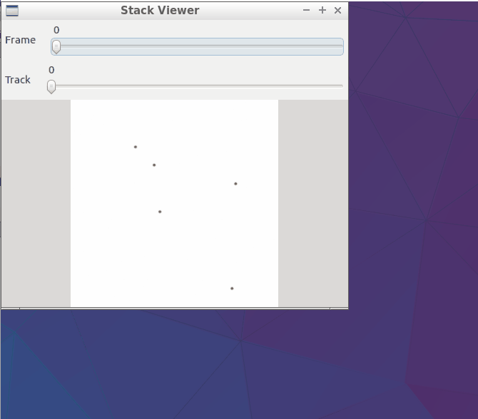

# OpenCV

<a href="/prog.cpp">This program</a> implements a tracking algorithm based on <a href="https://en.wikipedia.org/wiki/Distance_matrix">Distance Matrix</a> to <i>link</i> a spot in one frame to another spot in the next frame. The classes for modelling an image and for spot-detection use the OpenCV library (compatible with both <a href="http://docs.opencv.org/2.4/modules/refman.html">Version 2</a> and <a href="http://docs.opencv.org/3.1.0/">Version 3</a>) in C++ implementation (and <a href="https://imagej.nih.gov/ij/developer/api/">ImageJ API</a> in Java implementation). A <i>simplified</i> UML diagram is shown below:

 

The program has been tested under both Linux (Lubuntu) and Windows (with the <a href="http://www.codeblocks.org/">Code::Blocks</a> IDE and compiling all programs, including OpenCV, with <a href="http://www.mingw.org/">MinGW32</a>). The output looks like the following animation. The folder <a href="./Images">Images</a> contains sample images used for this demo.

